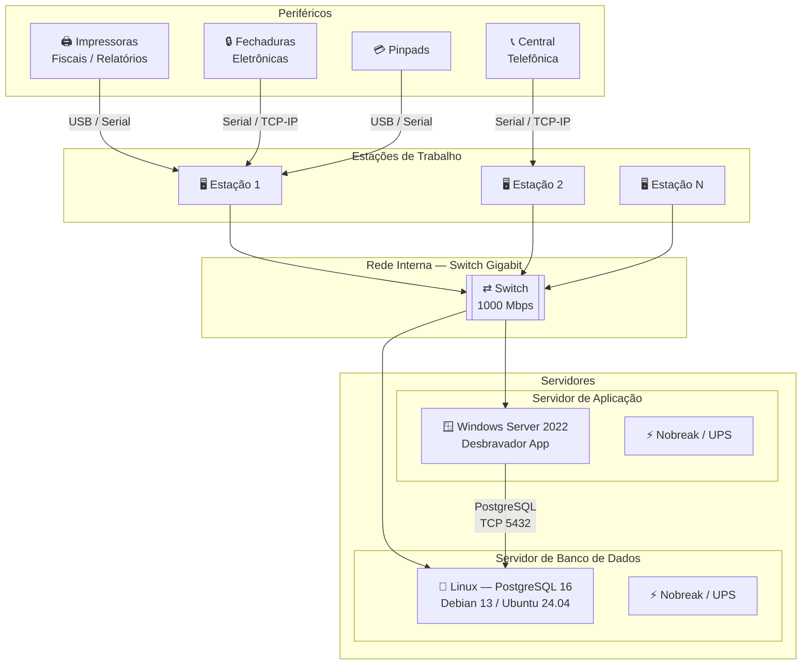

# Requisitos de Hardware e Software — Instalação Local

**Sistema:** Desbravador 4.1 / 3.1 / 3.0 Smart  
**Modalidade:** Instalação Local (On-Premise)  
**Público:** Cliente hoteleiro / Fornecedor de hardware

---

## Histórico de Revisões

| Versão | Data | Descrição | Responsável |
|--------|------|-----------|-------------|
| 1.0 | Abr/2026 | Criação do documento | Desbravador Software Ltda. |
| 1.1 | Abr/2026 | Atualização de hardware: novas faixas de usuários, processadores modernos, Windows Server 2022, Debian 13 / Ubuntu 24.04 | Desbravador Software Ltda. |

---

## 1. Objetivo

Este documento orienta o cliente hoteleiro na preparação do ambiente físico necessário para a instalação e operação do sistema Desbravador nas versões 4.1, 3.1 e 3.0 Smart, em modalidade de instalação local (on-premise).

As informações aqui descritas podem e devem ser repassadas ao fornecedor de hardware selecionado, servindo como guia para aquisição e configuração dos equipamentos.

### Visão Geral da Arquitetura On-Premise

---

## 2. Responsabilidades

### 2.1 Desbravador Software Ltda.

- A instalação do software Desbravador no servidor é realizada exclusivamente pelo Analista de Implantação da Desbravador.
- A equipe Desbravador estará disponível para esclarecer dúvidas técnicas durante todo o período de implantação.

### 2.2 Cliente (LICENCIADO)

- Providenciar os equipamentos conforme especificações deste documento, com sistema operacional previamente instalado e configurado.
- Garantir o licenciamento dos sistemas operacionais e softwares adicionais utilizados.
- Prover segurança física e lógica para servidores e estações de trabalho.
- Disponibilizar técnico de hardware durante o período de implantação.
- Garantir a instalação e configuração de periféricos (impressoras, centrais telefônicas, fechaduras eletrônicas) para as devidas integrações.
- Realizar e manter rotinas de backup dos dados do sistema.

> ⚠️ **Atenção**
> - A Desbravador **NÃO** realiza montagem/desmontagem de hardware nem instalação de sistemas operacionais.
> - A segurança dos arquivos e dados do sistema é responsabilidade exclusiva de quem opera o sistema.
> - Operações indevidas, falhas nas rotinas de backup ou uso de mídia defeituosa são de responsabilidade do LICENCIADO.

---

## 3. Seleção do Fornecedor de Hardware

Ao selecionar o fornecedor de equipamentos, certifique-se de que ele oferece:

- Suporte técnico disponível 24 horas por dia.
- Presença física na mesma cidade ou região próxima ao hotel.
- Garantia e assistência técnica dos equipamentos fornecidos.
- Capacidade de assumir responsabilidade pelo sistema operacional, rede e banco de dados.
- Referências de clientes e instalações anteriores verificáveis.

---

## 4. Configurações de Servidor por Quantidade de Usuários

O servidor deve ser **dedicado exclusivamente ao Desbravador**. Para cada faixa de usuários são apresentadas separadamente as especificações do **Servidor de Aplicação** e do **Servidor de Banco de Dados**.

---

### 4.1 De 01 a 15 Usuários Simultâneos

> O uso de dois servidores separados é **opcional**, mas recomendado para melhor desempenho.

#### ▸ Servidor de Aplicação

| Campo | Especificação |
|-------|---------------|
| **Placa-Mãe** | Compatível com expansão de memória RAM. Marcas de referência: Asus, Intel, Soyo, MSI, Gigabyte. |
| **Processador** | Intel Core i5 (12ª geração ou superior) · Intel Core i3 (gerações recentes) · AMD Ryzen 5 5600 ou superior |
| **Núcleos** | 4 a 6 núcleos físicos |
| **Frequência** | ≥ 3,5 GHz (prioridade alta) |
| **Memória RAM** | 12 GB |
| **Sistema Operacional** | Microsoft Windows Server 2022 licenciado |

#### ▸ Servidor de Banco de Dados

> **RECOMENDADO** — servidor separado é opcional nesta faixa, mas aumenta o desempenho.

| Campo | Especificação |
|-------|---------------|
| **Placa-Mãe** | Compatível com expansão de memória RAM. Marcas de referência: Asus, Intel, Soyo, MSI, Gigabyte. |
| **Processador** | Intel Core i7 (3,10 GHz) ou superior |
| **Memória RAM** | 8 GB |
| **Sistema Operacional** | Debian 13 ou Ubuntu 24.04 LTS — com Samba configurado |
| **Banco de Dados** | PostgreSQL 16 |

---

### 4.2 De 16 a 35 Usuários Simultâneos

> Dois servidores dedicados são **obrigatórios**: um Linux para o banco de dados e um Windows para a aplicação.

#### ▸ Servidor de Aplicação

| Campo | Especificação |
|-------|---------------|
| **Placa-Mãe** | Compatível com expansão de memória RAM. Marcas de referência: Asus, Intel, Soyo, MSI, Gigabyte. |
| **Processador** | Intel Xeon E-2336 ou superior · Intel Core i5/i7 ou superior · AMD Ryzen 5 5600 ou superior |
| **Diretrizes técnicas** | Priorizar CPUs com alto desempenho single thread · Frequência base ≥ 3,5 GHz · Mínimo 6 núcleos físicos · Suporte a instruções modernas e otimizações de virtualização |
| **Memória RAM** | 16 GB |
| **Sistema Operacional** | Microsoft Windows Server 2022 licenciado |

#### ▸ Servidor de Banco de Dados

> **OBRIGATÓRIO** nesta faixa.

| Campo | Especificação |
|-------|---------------|
| **Placa-Mãe** | Compatível com expansão de memória RAM. Marcas de referência: Asus, Intel, Soyo, MSI, Gigabyte. |
| **Processador** | Xeon E / i7 / Ryzen 7 ou equivalente |
| **Memória RAM** | 8 GB |
| **Sistema Operacional** | Debian 13 ou Ubuntu 24.04 LTS — com Samba configurado |
| **Banco de Dados** | PostgreSQL 16 |

---

### 4.3 35 ou Mais Usuários Simultâneos

> Dois servidores dedicados são **obrigatórios**: um Linux para o banco de dados e um Windows para a aplicação.

#### ▸ Servidor de Aplicação

| Campo | Especificação |
|-------|---------------|
| **Placa-Mãe** | Compatível com expansão de memória RAM. Marcas de referência: Asus, Intel, Soyo, MSI, Gigabyte. |
| **Processador** | Intel Xeon Silver ou superior · Intel Xeon Gold ou superior · AMD EPYC 7000 Series ou superior |
| **Diretrizes técnicas** | Mínimo 8 a 16 núcleos físicos · Frequência base ≥ 3,0 GHz · Alto volume de cache L3 · Suporte a memória ECC DDR4/DDR5 · Alta largura de banda de memória |
| **Memória RAM** | 32 GB |
| **Sistema Operacional** | Microsoft Windows Server 2022 licenciado |

#### ▸ Servidor de Banco de Dados

> **OBRIGATÓRIO** nesta faixa.

| Campo | Especificação |
|-------|---------------|
| **Placa-Mãe** | Compatível com expansão de memória RAM. Marcas de referência: Asus, Intel, Soyo, MSI, Gigabyte. |
| **Processador** | Xeon Silver / Gold / EPYC ou equivalente |
| **Memória RAM** | 32 GB |
| **Sistema Operacional** | Debian 13 ou Ubuntu 24.04 LTS — com Samba configurado |
| **Banco de Dados** | PostgreSQL 16 |

---

## 5. Estações de Trabalho

A qualidade das estações impacta diretamente o desempenho percebido pelo usuário.

### 5.1 Vida Útil e Processador

- Computadores devem ter no máximo **3 anos de uso**, principalmente em função do processador.
- Considerar processadores **Intel Core i3, i5, i7, i9** ou equivalentes AMD Ryzen.
- **Desconsiderar** processadores Celeron, Atom e demais processadores de baixíssima performance.
- Velocidade base mínima do processador: **2 GHz**.
- STR (Single Thread Rating) mínimo: **2000** — consulte [cpubenchmark.net](https://www.cpubenchmark.net/singleThread.html) para verificação.

### 5.2 Memória e Armazenamento

| Cenário | Memória RAM | Disco |
|---------|-------------|-------|
| Estações usando apenas o Desbravador | Mínimo 8 GB | 500 GB |
| Estações com o Desbravador e outros aplicativos | Mínimo 16 GB | 500 GB |

### 5.3 Demais Requisitos

| Componente | Especificação |
|------------|---------------|
| **Armazenamento** | SSD (preferencialmente) |
| **Placa de Rede** | Gigabit Ethernet 1000 Mbps |
| **Portas Seriais** | Obrigatório para conexão com impressoras fiscais (ou adaptador USB-Serial homologado) |
| **Antivírus** | Obrigatório (solução licenciada) |
| **Sistema Operacional** | Microsoft Windows 11 ou superior (Professional ou Home), licenciado |

---

## 6. Hardwares Complementares (Todas as Configurações)

### 6.1 Armazenamento

- **Servidor de Aplicação:** 2 discos de 500 GB SSD (preferencialmente em RAID 1 para redundância).
- **Servidor de Banco de Dados:** 1 disco de 1 TB SSD.

### 6.2 Dispositivos de Backup

- HD externo, Pen Drive e/ou armazenamento em nuvem.
- **IMPORTANTE:** dispositivos externos de backup devem ser conectados ao servidor apenas no momento da realização do backup.

### 6.3 Rede

- **Placa de rede:** Gigabit Ethernet 1000 Mbps (pode ser integrada à placa-mãe). Marcas de referência: 3COM, Encore, TP-Link.
- **Switch:** portas 1000 Mbps. Marcas de referência: Dell, HP, 3COM, Encore, TP-Link.
- ⚠️ A placa de rede do servidor e o switch devem ter a **mesma capacidade Gigabit**. A velocidade de comunicação é limitada pelo componente mais lento da cadeia.

### 6.4 Proteção Elétrica

- **Nobreak (UPS)** para o servidor — indispensável para proteger o banco de dados contra quedas de energia.

---

## 7. Integração com Central Telefônica

O Desbravador pode ser integrado a qualquer central telefônica que emita bilhete serial, bem como centrais com protocolo TCP/IP.

- O técnico da central deve disponibilizar o cabo serial até a máquina mais próxima.
- Nenhum software tarifário adicional é necessário — o programa de coleta de registros é fornecido pela Desbravador.
- Verificar marca e modelo da central com antecedência junto à equipe Desbravador, antes da aquisição ou instalação.

---

## 8. Periféricos Homologados

O sistema possui integração desenvolvida e homologada com os seguintes periféricos:

- 🔒 [Fechaduras magnéticas homologadas](../../_shared/fechaduras-homologadas.md)
- 🖨️ [Impressoras homologadas](../../_shared/impressoras-homologadas.md)
- 💳 [Pinpads homologados](../../_shared/pinpads-homologados.md)

---

## 9. Acesso Remoto (Quando Aplicável)

Para hotéis que necessitem de acesso externo ao sistema ou banco de dados fora do estabelecimento.

### 9.1 Servidor de Aplicação

- Deve funcionar como Controlador de Domínio.
- Deve administrar o serviço de Terminal Service (Remote Desktop Services — RDS).

### 9.2 Servidor de Internet

- Deve desempenhar as funções de Proxy, Firewall e VPN para acesso via rede pública.
- A estrutura deve contar com Firewall e Switch de alta disponibilidade para proteção do banco de dados.
- Recomenda-se link de internet dedicado com link de contingência (ex.: 4G/ADSL) para o caso de queda da conexão principal.
- Consumo estimado por usuário via Terminal Service: aproximadamente 60 KB/s.

---

## 10. Contato e Suporte

**Desbravador Software Ltda.**  
🌐 [www.desbravador.com.br](https://www.desbravador.com.br)

Para dúvidas técnicas durante a implantação, a equipe Desbravador estará disponível para esclarecimentos.
