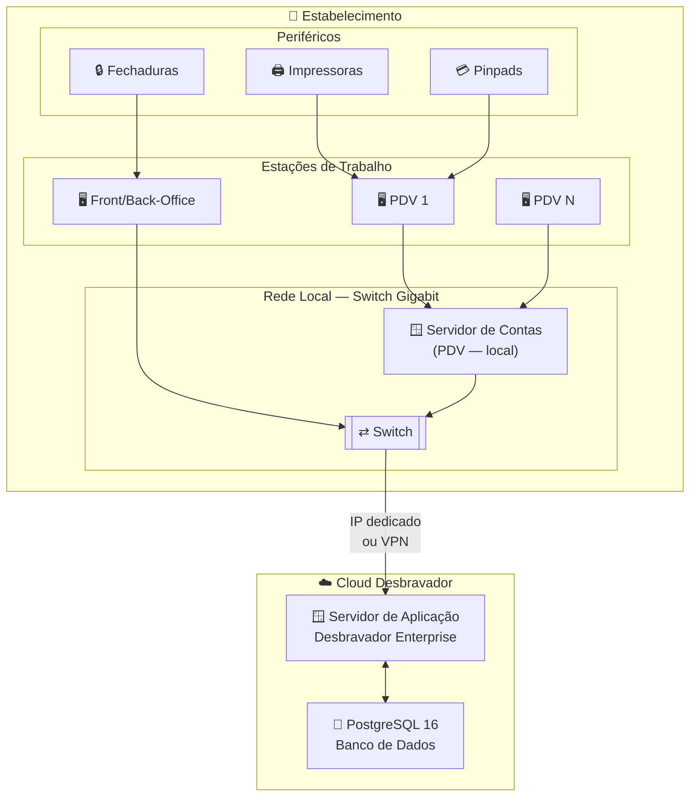

# Requisitos de Hardware — Desbravador Enterprise / 4.0 — Cloud

**Sistema:** Desbravador Enterprise / 4.0  
**Modalidade:** Cloud — Totalmente em nuvem  
**Público:** Cliente / Equipe de TI

---

## Histórico de Revisões

| Versão | Data | Descrição | Responsável |
| --- | --- | --- | --- |
| 1.0 | Mai/2026 | Criação do documento | Desbravador Software Ltda. |
| 1.1 | Mai/2026 | Remoção de referências a produto específico de nuvem; conexão via IP dedicado ou VPN | Desbravador Software Ltda. |

---

> ℹ️ Nesta modalidade, **toda a infraestrutura de aplicação e banco de dados é provisionada e mantida pela Desbravador** na infraestrutura Cloud Desbravador. O cliente não precisa provisionar nenhum servidor. No estabelecimento permanecem apenas as estações de trabalho, os periféricos físicos e o Servidor de Contas para os terminais de PDV.

> ⚠️ **Pré-requisito crítico** — Por não haver servidor de aplicação local, **a operação do sistema depende inteiramente da conectividade com a nuvem**. Um link dedicado ou VPN estável é o principal requisito desta modalidade.

---

## 1. Objetivo

Este documento orienta o cliente na preparação do ambiente das estações de trabalho e da infraestrutura de rede necessária para a operação do Desbravador Enterprise / 4.0 na modalidade cloud.

---

## 2. Visão Geral da Arquitetura

---

## 3. Responsabilidades

### 3.1 Desbravador Software Ltda.

- Provisionamento e manutenção de toda a infraestrutura de servidores na infraestrutura Cloud Desbravador.
- Atualizações de versão aplicadas automaticamente, sem intervenção do cliente.
- Monitoramento de disponibilidade e backup da infraestrutura cloud.
- Suporte técnico durante o período de implantação e operação.

### 3.2 Cliente (LICENCIADO)

- Prover e manter as estações de trabalho conforme as especificações deste documento.
- Garantir a qualidade e estabilidade do link dedicado ou VPN.
- Instalar e manter periféricos físicos (impressoras, pinpads, fechaduras).
- Manter antivírus instalado e atualizado em todas as estações.

> ⚠️ **Atenção**
> - A Desbravador **NÃO** realiza montagem/desmontagem de hardware nas estações do cliente.
> - A qualidade da operação está diretamente vinculada à qualidade da conectividade contratada.

---

## 4. Servidor de Contas — PDV

O módulo de PDV do Desbravador Enterprise / 4.0 utiliza a mesma tecnologia do **Desbravador Fast**. Para operação dos terminais de PDV é necessário um **Servidor de Contas local**, mesmo na modalidade cloud total. Aplicação e banco de dados do sistema principal estão na nuvem, mas os caixas de PDV dependem do Servidor de Contas na rede local.

> ⚠️ O Servidor de Contas é **sempre local**, mesmo nesta modalidade. Sem ele, os terminais de PDV não operam.

> ℹ️ Deve ter **IP fixo na rede interna** e estar acessível por todas as estações de caixa.

| Terminais de PDV | Processador | RAM | Armazenamento | Sistema Operacional |
| :---: | --- | :---: | --- | --- |
| 1 a 15 | Intel Core i5 (12ª geração ou superior) · AMD Ryzen 5 ou superior | 8 GB | SSD NVMe 240 GB | Windows Server 2022 ou Windows 11 Pro |
| 16 a 40 | Intel Core i7 (12ª geração ou superior) · AMD Ryzen 9 ou superior | 16 GB | SSD NVMe 500 GB | Windows Server 2022 |
| Acima de 40 | Entre em contato com a equipe de TI da Desbravador para dimensionamento. | — | — | — |

> ⚠️ Nobreak (UPS) **obrigatório** no Servidor de Contas.

---

## 5. Estações de Trabalho

As estações são classificadas por perfil de uso, cada um com requisitos e periféricos distintos. Computadores devem ter no máximo **3 anos de uso** e processadores Intel Core i3/i5/i7/i9 ou AMD Ryzen equivalentes — desconsiderar Celeron, Atom e similares.

> ℹ️ **Front-Office e Back-Office** conectam-se ao Cloud Desbravador via IP dedicado ou VPN. **PDV** conecta-se ao Servidor de Contas local (seção 4).

### 5.1 Front-Office — Recepção e Reservas / Back-Office — Financeiro, Estoque e Compras

Estações de trabalho utilizadas nos setores operacionais e administrativos do hotel, destinadas às atividades de recepção e atendimento ao hóspede, como realização de check-in, check-out, consultas de reservas e suporte operacional, bem como às rotinas administrativas, incluindo financeiro, gestão de estoque, compras e emissão de relatórios gerenciais. A conexão com o sistema é feita via IP dedicado ou VPN — não há instalação de aplicação local.

| Componente | Requisito Mínimo | Recomendado |
| --- | --- | --- |
| **Processador** | Intel Core i3 (12ª geração) · AMD Ryzen 3 | Intel Core i5 ou superior |
| **Memória RAM** | 8 GB | 16 GB |
| **Armazenamento** | SSD 240 GB | SSD 500 GB |
| **Monitor** | Full HD 1920×1080 | Full HD 1920×1080 |
| **Placa de Rede** | Gigabit Ethernet (1000 Mbps) | Gigabit Ethernet (1000 Mbps) |
| **Sistema Operacional** | Windows 11 licenciado | Windows 11 licenciado |
| **Antivírus** | Obrigatório | Obrigatório |
| **Nobreak (UPS)** | Recomendado | Recomendado |

### 5.2 PDV — Caixa, Venda Rápida e Controle de Pensão

Terminais de ponto de venda. Conectam-se ao **Servidor de Contas local** (seção 4). Windows é **obrigatório** em todas as estações de PDV para integração com periféricos fiscais e de pagamento.

| Componente | Requisito Mínimo | Recomendado |
| --- | --- | --- |
| **Processador** | Intel Core i5 (12ª geração) · AMD Ryzen 5 | Intel Core i5/i7 ou superior |
| **Memória RAM** | 8 GB | 16 GB |
| **Armazenamento** | SSD 240 GB | SSD 500 GB |
| **Monitor** | 1× Full HD 1920×1080 | Touch screen (venda rápida) |
| **Portas** | USB + Serial ou adaptador USB-Serial homologado | — |
| **Placa de Rede** | Gigabit Ethernet (1000 Mbps) | Gigabit Ethernet (1000 Mbps) |
| **Sistema Operacional** | **Windows 11 licenciado** (obrigatório) | Windows 11 Pro |
| **Antivírus** | Obrigatório | Obrigatório |
| **Nobreak (UPS)** | **Obrigatório** | Obrigatório |

> ⚠️ O nobreak é **obrigatório** nas estações de PDV — queda de energia durante operação de caixa causa perda de transações e inconsistência fiscal.

---

## 6. Requisitos de Rede e Conectividade

Este é o **requisito mais crítico** da modalidade cloud. A qualidade da operação está diretamente ligada à qualidade da conexão com a infraestrutura Cloud Desbravador.

### 6.1 Tipo de conexão

| Opção | Descrição |
| --- | --- |
| **IP dedicado** | Link de internet dedicado com IP fixo — conexão direta aos servidores Cloud Desbravador |
| **VPN** | Túnel VPN sobre link de internet — recomendado quando IP dedicado não está disponível |

> ⚠️ Conexões de internet residencial ou compartilhada não são adequadas para esta modalidade. Oscilações causam falhas de sessão e perda de operação.

### 6.2 Requisitos do link

| Requisito | Especificação |
| --- | --- |
| **Tipo de link** | Fibra óptica dedicada ou link empresarial |
| **Latência (RTT)** | ≤ 30 ms para os servidores Cloud Desbravador |
| **Jitter** | ≤ 5 ms |
| **Perda de pacotes** | ≤ 0,1% |

### 6.3 Largura de banda por quantidade de usuários simultâneos

| Usuários simultâneos | Download mínimo | Upload mínimo | Recomendado |
| :---: | :---: | :---: | --- |
| Até 15 | 30 Mbps | 15 Mbps | 50 Mbps fibra |
| 16 a 40 | 80 Mbps | 40 Mbps | 200 Mbps fibra |
| Acima de 40 | Entre em contato com a equipe de TI da Desbravador para dimensionamento. | — | — |

### 6.4 Link de contingência

| Requisito | Especificação |
| --- | --- |
| **Obrigatoriedade** | **Obrigatório** — sem contingência, falha no link principal paralisa toda a operação |
| **Tipo** | 4G/5G (roteador dedicado) ou segundo link de fibra de provedor diferente |
| **Ativação** | Automática (failover) ou manual — conforme equipamento de rede |

### 6.5 Rede local

| Requisito | Especificação |
| --- | --- |
| **Switch** | Gigabit Ethernet 1000 Mbps |
| **Cabeamento** | Cat5e mínimo · Cat6 recomendado |
| **Wi-Fi** | Wi-Fi 5 (802.11ac) mínimo para dispositivos móveis · Wi-Fi 6 recomendado |

### 6.6 URL obrigatória — liberação em proxy/firewall de saída

> ⚠️ O endereço `https://servicos.desbravador.com.br/` deve estar **permitido (bypass)** em proxies, filtros de conteúdo e firewalls de saída. O bloqueio desta URL impede o funcionamento de serviços essenciais do sistema.

> ℹ️ Para a configuração de firewall e as portas utilizadas pelo Servidor de Contas e demais serviços Desbravador na rede local, consulte: [Padrão de Portas e Configuração de Firewall](./../../infraestrutura/portas-e-firewall.md)

---

## 7. Dispositivos Móveis — iPDV

| Requisito | Especificação |
| --- | --- |
| **Sistema Operacional** | Android 11 ou superior |
| **Processador** | Quad-core 2 GHz ou superior |
| **Memória RAM** | 4 GB mínimo · 8 GB recomendado |
| **Armazenamento interno** | 32 GB mínimo |
| **Conectividade** | Wi-Fi 802.11 ac (5 GHz) ou superior |

> ℹ️ Para a lista completa de dispositivos Smart POS homologados: [Dispositivos iPDV e PDV homologados](./../../perifericos/dispositivos-ipdv-pdv.md)

---

## 8. Periféricos Homologados

Periféricos físicos (impressoras, pinpads, fechaduras) são conectados diretamente às estações de trabalho locais.

- 🔒 [Fechaduras magnéticas homologadas](./../../perifericos/fechaduras-homologadas.md)
- 🖨️ [Impressoras homologadas](./../../perifericos/impressoras-homologadas.md)
- 💳 [Pinpads homologados](./../../perifericos/pinpads-homologados.md)
- 💳 [Sistemas de TEF homologados](./../../perifericos/tef-homologados.md)
- 📱 [Dispositivos iPDV e PDV homologados](./../../perifericos/dispositivos-ipdv-pdv.md)
- 🍳 [Desbravador KDS — requisitos de hardware e infraestrutura](./../../perifericos/kds-desbravador.md)

---

## 9. Contato e Suporte

**Desbravador Software Ltda.**  
 🌐 [www.desbravador.com.br](https://www.desbravador.com.br)

Para contratação da modalidade cloud ou dúvidas sobre infraestrutura, entre em contato com a equipe técnica da Desbravador.
