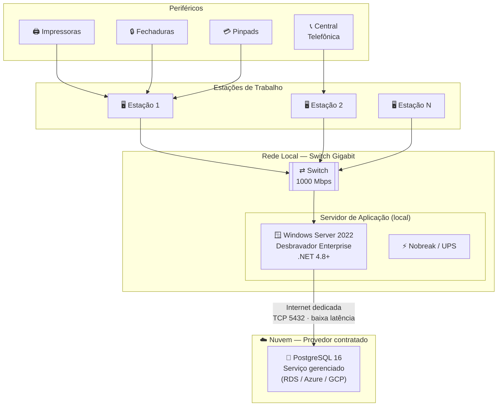

# Requisitos de Hardware — Desbravador Enterprise / 4.0 — Híbrido

**Sistema:** Desbravador Enterprise / 4.0  
**Modalidade:** Híbrido — Aplicação local + Banco de dados em nuvem  
**Público:** Cliente / Equipe de TI / Fornecedor de hardware

---

## Histórico de Revisões

| Versão | Data | Descrição | Responsável |
| --- | --- | --- | --- |
| 1.0 | Mai/2026 | Criação do documento | Desbravador Software Ltda. |

---

> ℹ️ Nesta modalidade, o **servidor de aplicação permanece nas dependências do cliente** (Windows Server, on-premise), enquanto o **banco de dados PostgreSQL é provisionado em nuvem** — em serviço gerenciado como AWS RDS, Azure Database for PostgreSQL, Google Cloud SQL ou equivalente.

> ⚠️ **Pré-requisito crítico** — A conexão entre o servidor de aplicação local e o banco de dados em nuvem deve ser **estável, dedicada e com baixa latência** (≤ 20 ms recomendado). Oscilações de conexão causam falhas de transação e degradação severa de desempenho.

---

## 1. Objetivo

Este documento orienta o cliente e a equipe de TI na preparação do ambiente físico e de rede necessário para a implantação do Desbravador Enterprise / 4.0 na modalidade híbrida.

Nesta configuração, o cliente é responsável por prover e manter o servidor de aplicação local. O banco de dados é hospedado em nuvem e gerenciado pelo provedor contratado.

---

## 2. Visão Geral da Arquitetura

---

## 3. Responsabilidades

### 3.1 Desbravador Software Ltda.

- Instalação e configuração do Desbravador Enterprise no servidor de aplicação local.
- Suporte técnico durante o período de implantação.

### 3.2 Cliente (LICENCIADO)

- Prover e manter o servidor de aplicação local conforme as especificações deste documento.
- Contratar e configurar o serviço gerenciado de banco de dados em nuvem (PostgreSQL 16).
- Garantir a conectividade entre o servidor local e o banco de dados em nuvem (latência, estabilidade, regras de firewall).
- Garantir o licenciamento dos sistemas operacionais e softwares utilizados.
- Disponibilizar técnico de hardware durante o período de implantação.
- Realizar rotinas de backup conforme orientação do provedor de nuvem.

> ⚠️ **Atenção**
> - A Desbravador **NÃO** realiza configuração de serviços de nuvem de terceiros (AWS, Azure, GCP).
> - A Desbravador **NÃO** realiza montagem/desmontagem de hardware nem instalação de sistemas operacionais.

---

## 4. Servidor de Aplicação — Especificações por Porte

O servidor de aplicação deve ser **dedicado exclusivamente ao Desbravador Enterprise**. O banco de dados é remoto (nuvem), portanto não há servidor de banco de dados local.

---

### 4.1 Até 15 Estações Simultâneas

| Campo | Especificação |
| --- | --- |
| **Processador** | Intel Core i5 (12ª geração ou superior) · AMD Ryzen 5 5600 ou superior |
| **Núcleos** | 4 a 6 núcleos físicos |
| **Frequência** | ≥ 3,5 GHz |
| **Memória RAM** | 16 GB |
| **Armazenamento** | SSD NVMe 500 GB |
| **Sistema Operacional** | Microsoft Windows Server 2022 licenciado |
| **Runtime** | .NET Framework 4.8 ou superior |

---

### 4.2 De 16 a 40 Estações Simultâneas

| Campo | Especificação |
| --- | --- |
| **Processador** | Intel Xeon E-2300 series · Intel Core i7 (12ª geração ou superior) · AMD Ryzen 9 ou superior |
| **Núcleos** | Mínimo 8 núcleos físicos |
| **Frequência** | ≥ 3,5 GHz |
| **Memória RAM** | 32 GB |
| **Armazenamento** | 2× SSD NVMe 1 TB (RAID 1 recomendado) |
| **Sistema Operacional** | Microsoft Windows Server 2022 licenciado |
| **Runtime** | .NET Framework 4.8 ou superior |

---

### 4.3 Acima de 40 Estações

> Para ambientes acima de 40 estações simultâneas, entre em contato com a equipe de TI da Desbravador para dimensionamento correto da infraestrutura.

---

## 5. Banco de Dados em Nuvem — Requisitos Mínimos

O banco de dados é provisionado no provedor de nuvem escolhido pelo cliente. Os requisitos abaixo devem ser atendidos na instância contratada:

| Porte | vCPUs | RAM | Armazenamento | Tipo |
| --- | :---: | :---: | :---: | --- |
| Até 15 estações | 2 vCPUs | 8 GB | 200 GB SSD | PostgreSQL 16 gerenciado |
| 16 a 40 estações | 8 vCPUs | 32 GB | 1 TB SSD | PostgreSQL 16 gerenciado |
| Acima de 40 estações | Entre em contato com a equipe de TI da Desbravador para dimensionamento. | — | — | — |

> ℹ️ Provedores homologados: AWS RDS for PostgreSQL, Azure Database for PostgreSQL, Google Cloud SQL for PostgreSQL. Outros provedores devem ser validados com a equipe Desbravador antes da contratação.

---

## 6. Requisitos de Conectividade

> ⚠️ **URL obrigatória — liberação em proxy/firewall de saída**
> O endereço `https://servicos.desbravador.com.br/` deve estar **permitido (bypass)** em proxies, filtros de conteúdo e firewalls de saída. O bloqueio desta URL impede o funcionamento de serviços essenciais do sistema.

A conexão entre o servidor de aplicação local e o banco de dados em nuvem é crítica para o desempenho do sistema.

| Requisito | Especificação |
| --- | --- |
| **Latência (RTT)** | ≤ 20 ms (recomendado) · ≤ 50 ms (máximo aceitável) |
| **Velocidade de upload** | Mínimo 50 Mbps dedicado |
| **Velocidade de download** | Mínimo 50 Mbps dedicado |
| **Tipo de link** | Fibra óptica dedicada ou link empresarial |
| **Estabilidade** | Jitter ≤ 5 ms · Perda de pacotes ≤ 0,1% |
| **Link de contingência** | Obrigatório (ex.: 4G/5G) |
| **Porta TCP** | 5432 (PostgreSQL) liberada no firewall em ambas as pontas |

> ℹ️ A porta 5432 deve ser liberada **exclusivamente entre o servidor de aplicação e o banco de dados em nuvem** — nunca exposta para a internet. Para o padrão completo de portas e orientações de firewall, consulte: [Padrão de Portas e Configuração de Firewall](./../../infraestrutura/portas-e-firewall.md)

> ⚠️ **Atenção** — Latência acima de 50 ms causa lentidão perceptível no sistema. Links com oscilação ou perda de pacotes causam falhas de transação. Medir latência real para a região do provedor de nuvem antes de contratar.

---

## 7. Servidor de Contas — PDV

O módulo de PDV do Desbravador Enterprise / 4.0 utiliza a mesma tecnologia do **Desbravador Fast**. Para operação dos terminais de PDV é necessário um **Servidor de Contas local**, independentemente de o banco de dados estar em nuvem.

> ⚠️ O Servidor de Contas é **sempre local** nesta modalidade. Sem ele, os terminais de PDV não operam.

> ℹ️ Deve ter **IP fixo na rede interna** e estar acessível por todas as estações de caixa.

| Terminais de PDV | Processador | RAM | Armazenamento | Sistema Operacional |
| :---: | --- | :---: | --- | --- |
| 1 a 15 | Intel Core i5 (12ª geração ou superior) · AMD Ryzen 5 ou superior | 8 GB | SSD NVMe 240 GB | Windows Server 2022 ou Windows 11 Pro |
| 16 a 40 | Intel Core i7 (12ª geração ou superior) · AMD Ryzen 9 ou superior | 16 GB | SSD NVMe 500 GB | Windows Server 2022 |
| Acima de 40 | Entre em contato com a equipe de TI da Desbravador para dimensionamento. | — | — | — |

> ⚠️ Nobreak (UPS) **obrigatório** no Servidor de Contas.

---

## 8. Estações de Trabalho

As estações são classificadas por perfil de uso, cada um com requisitos e periféricos distintos. Computadores devem ter no máximo **3 anos de uso** e processadores Intel Core i3/i5/i7/i9 ou AMD Ryzen equivalentes — desconsiderar Celeron, Atom e similares.

### 8.1 Front-Office — Recepção e Reservas / Back-Office — Financeiro, Estoque e Compras

Estações de trabalho utilizadas nos setores operacionais e administrativos do hotel, destinadas às atividades de recepção e atendimento ao hóspede, como realização de check-in, check-out, consultas de reservas e suporte operacional, bem como às rotinas administrativas, incluindo financeiro, gestão de estoque, compras e emissão de relatórios gerenciais.

| Componente | Requisito Mínimo | Recomendado |
| --- | --- | --- |
| **Processador** | Intel Core i3 (12ª geração) · AMD Ryzen 3 | Intel Core i5 ou superior |
| **Memória RAM** | 8 GB | 16 GB |
| **Armazenamento** | SSD 240 GB | SSD 500 GB |
| **Monitor** | Full HD 1920×1080 | Full HD 1920×1080 |
| **Placa de Rede** | Gigabit Ethernet (1000 Mbps) | Gigabit Ethernet (1000 Mbps) |
| **Sistema Operacional** | Windows 11 licenciado | Windows 11 licenciado |
| **Antivírus** | Obrigatório | Obrigatório |
| **Nobreak (UPS)** | Recomendado | Recomendado |

### 8.2 PDV — Caixa, Venda Rápida e Controle de Pensão

Terminais de ponto de venda. Conectam-se ao **Servidor de Contas local** (seção 7). Windows é **obrigatório** em todas as estações de PDV para integração com periféricos fiscais e de pagamento.

| Componente | Requisito Mínimo | Recomendado |
| --- | --- | --- |
| **Processador** | Intel Core i5 (12ª geração) · AMD Ryzen 5 | Intel Core i5/i7 ou superior |
| **Memória RAM** | 8 GB | 16 GB |
| **Armazenamento** | SSD 240 GB | SSD 500 GB |
| **Monitor** | 1× Full HD 1920×1080 | Touch screen (venda rápida) |
| **Portas** | USB + Serial ou adaptador USB-Serial homologado | — |
| **Placa de Rede** | Gigabit Ethernet (1000 Mbps) | Gigabit Ethernet (1000 Mbps) |
| **Sistema Operacional** | **Windows 11 licenciado** (obrigatório) | Windows 11 Pro |
| **Antivírus** | Obrigatório | Obrigatório |
| **Nobreak (UPS)** | **Obrigatório** | Obrigatório |

> ⚠️ O nobreak é **obrigatório** nas estações de PDV — queda de energia durante operação de caixa causa perda de transações e inconsistência fiscal.

---

## 9. Periféricos Homologados

- 🔒 [Fechaduras magnéticas homologadas](./../../perifericos/fechaduras-homologadas.md)
- 🖨️ [Impressoras homologadas](./../../perifericos/impressoras-homologadas.md)
- 💳 [Pinpads homologados](./../../perifericos/pinpads-homologados.md)
- 💳 [Sistemas de TEF homologados](./../../perifericos/tef-homologados.md)
- 📱 [Dispositivos iPDV e PDV homologados](./../../perifericos/dispositivos-ipdv-pdv.md)
- 🍳 [Desbravador KDS — requisitos de hardware e infraestrutura](./../../perifericos/kds-desbravador.md)

---

## 9. Contato e Suporte

**Desbravador Software Ltda.**  
 🌐 [www.desbravador.com.br](https://www.desbravador.com.br)

Para dúvidas técnicas durante a implantação, a equipe Desbravador estará disponível para esclarecimentos.
