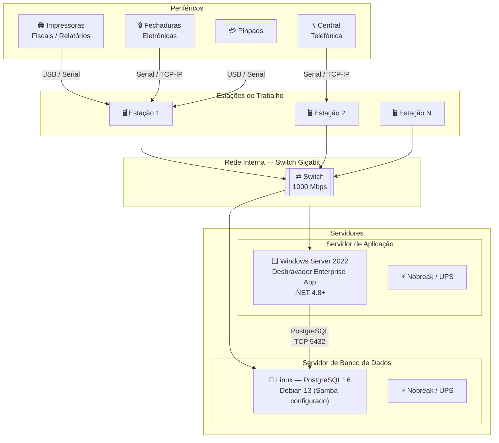

# Requisitos de Hardware — Desbravador Enterprise / 4.0

**Sistema:** Desbravador Enterprise / 4.0  
**Modalidade:** Instalação Local (On-Premise)  
**Público:** Cliente / Equipe de TI / Fornecedor de hardware

---

## Histórico de Revisões

| Versão | Data | Descrição | Responsável |
| --- | --- | --- | --- |
| 1.0 | Mai/2026 | Criação do documento | Desbravador Software Ltda. |

---

> ℹ️ **Nota sobre nomenclatura** — O Desbravador Enterprise / 4.0 era anteriormente denominado **Desbravador 4.5**. Toda documentação, contratos e referências técnicas anteriores sob esse nome aplicam-se a este sistema.

---

## 1. Objetivo

Este documento orienta o cliente na preparação do ambiente físico necessário para a instalação e operação do sistema Desbravador Enterprise / 4.0 em modalidade local (on-premise).

As informações aqui descritas podem e devem ser repassadas ao fornecedor de hardware selecionado, servindo como guia para aquisição e configuração dos equipamentos.

### Visão Geral da Arquitetura On-Premise

---

## 2. Responsabilidades

### 2.1 Desbravador Software Ltda.

- A instalação do software Desbravador Enterprise no servidor é realizada exclusivamente pelo Analista de Implantação da Desbravador.
- A equipe Desbravador estará disponível para esclarecer dúvidas técnicas durante todo o período de implantação.

### 2.2 Cliente (LICENCIADO)

- Providenciar os equipamentos conforme especificações deste documento, com sistema operacional previamente instalado e configurado.
- Garantir o licenciamento dos sistemas operacionais e softwares adicionais utilizados.
- Prover segurança física e lógica para servidores e estações de trabalho.
- Disponibilizar técnico de hardware durante o período de implantação.
- Garantir a instalação e configuração de periféricos (impressoras, centrais telefônicas, fechaduras eletrônicas) para as devidas integrações.
- Realizar e manter rotinas de backup dos dados do sistema.

> ⚠️ **Atenção**
> - A Desbravador **NÃO** realiza montagem/desmontagem de hardware nem instalação de sistemas operacionais.
> - A segurança dos arquivos e dados do sistema é responsabilidade exclusiva de quem opera o sistema.
> - Operações indevidas, falhas nas rotinas de backup ou uso de mídia defeituosa são de responsabilidade do LICENCIADO.

---

## 3. Seleção do Fornecedor de Hardware

Ao selecionar o fornecedor de equipamentos, certifique-se de que ele oferece:

- Suporte técnico disponível 24 horas por dia.
- Presença física na mesma cidade ou região próxima ao estabelecimento.
- Garantia e assistência técnica dos equipamentos fornecidos.
- Capacidade de assumir responsabilidade pelo sistema operacional, rede e banco de dados.
- Referências de clientes e instalações anteriores verificáveis.

---

## 4. Configurações de Servidor por Ambiente

O servidor deve ser **dedicado exclusivamente ao Desbravador Enterprise**. As especificações abaixo são organizadas por porte do ambiente, com separação entre **Servidor de Aplicação** e **Servidor de Banco de Dados**.

---

### 4.1 Até 15 Estações Simultâneas

> O uso de dois servidores separados é **opcional**, mas recomendado para melhor desempenho.

#### ▸ Servidor de Aplicação

| Campo | Especificação |
| --- | --- |
| **Processador** | Intel Core i5 (12ª geração ou superior) · AMD Ryzen 5 5600 ou superior |
| **Núcleos** | 4 a 6 núcleos físicos |
| **Frequência** | ≥ 3,5 GHz |
| **Memória RAM** | 16 GB |
| **Armazenamento** | 2× SSD NVMe 500 GB (RAID 1 recomendado) |
| **Sistema Operacional** | Microsoft Windows Server 2022 licenciado |
| **Runtime** | .NET Framework 4.8 ou superior |

#### ▸ Servidor de Banco de Dados

> **RECOMENDADO** — servidor separado é opcional nesta faixa, mas aumenta o desempenho.

| Campo | Especificação |
| --- | --- |
| **Processador** | Intel Core i7 (12ª geração ou superior) · AMD Ryzen 7 ou superior |
| **Memória RAM** | 8 GB |
| **Armazenamento** | SSD NVMe 500 GB |
| **Sistema Operacional** | Debian 13 — com Samba configurado |
| **Banco de Dados** | PostgreSQL 16 |

---

### 4.2 De 16 a 40 Estações Simultâneas

> Dois servidores dedicados são **obrigatórios**: um Linux para banco de dados e um Windows para a aplicação.

#### ▸ Servidor de Aplicação

| Campo | Especificação |
| --- | --- |
| **Processador** | Intel Xeon E-2300 series · Intel Core i7 (12ª geração ou superior) · AMD Ryzen 9 ou superior |
| **Núcleos** | Mínimo 8 núcleos físicos |
| **Frequência** | ≥ 3,5 GHz |
| **Memória RAM** | 32 GB |
| **Armazenamento** | 2× SSD NVMe 1 TB (RAID 1 recomendado) |
| **Sistema Operacional** | Microsoft Windows Server 2022 licenciado |
| **Runtime** | .NET Framework 4.8 ou superior |

#### ▸ Servidor de Banco de Dados

| Campo | Especificação |
| --- | --- |
| **Processador** | Intel Xeon E-2300 series · AMD Ryzen 9 ou equivalente |
| **Memória RAM** | 16 GB |
| **Armazenamento** | SSD NVMe 2 TB |
| **Sistema Operacional** | Debian 13 — com Samba configurado |
| **Banco de Dados** | PostgreSQL 16 |

---

### 4.3 Acima de 40 Estações

> Para ambientes acima de 40 estações simultâneas, entre em contato com a equipe de TI da Desbravador para dimensionamento correto da infraestrutura.

---

## 5. Servidor de Contas — PDV

O módulo de PDV do Desbravador Enterprise / 4.0 utiliza a mesma tecnologia do **Desbravador Fast**. Para operação dos terminais de PDV é necessário um **Servidor de Contas local**, dedicado a essa função.

> ℹ️ O Servidor de Contas gerencia as sessões dos terminais de PDV na rede local. Deve ter **IP fixo na rede interna** e estar acessível por todas as estações de caixa.

| Terminais de PDV | Processador | RAM | Armazenamento | Sistema Operacional |
| :---: | --- | :---: | --- | --- |
| 1 a 15 | Intel Core i5 (12ª geração ou superior) · AMD Ryzen 5 ou superior | 8 GB | SSD NVMe 240 GB | Windows Server 2022 ou Windows 11 Pro |
| 16 a 40 | Intel Core i7 (12ª geração ou superior) · AMD Ryzen 9 ou superior | 16 GB | SSD NVMe 500 GB | Windows Server 2022 |
| Acima de 40 | Entre em contato com a equipe de TI da Desbravador para dimensionamento. | — | — | — |

> ⚠️ Nobreak (UPS) **obrigatório** no Servidor de Contas — queda de energia durante operação de PDV causa inconsistência de dados e falha nas transações fiscais.

---

## 6. Estações de Trabalho

As estações são classificadas por perfil de uso, cada um com requisitos e periféricos distintos. Computadores devem ter no máximo **3 anos de uso** e processadores Intel Core i3/i5/i7/i9 ou AMD Ryzen equivalentes — desconsiderar Celeron, Atom e similares.

### 6.1 Front-Office — Recepção e Reservas / Back-Office — Financeiro, Estoque e Compras

Estações de trabalho utilizadas nos setores operacionais e administrativos do hotel, destinadas às atividades de recepção e atendimento ao hóspede, como realização de check-in, check-out, consultas de reservas e suporte operacional, bem como às rotinas administrativas, incluindo financeiro, gestão de estoque, compras e emissão de relatórios gerenciais.

| Componente | Requisito Mínimo | Recomendado |
| --- | --- | --- |
| **Processador** | Intel Core i3 (12ª geração) · AMD Ryzen 3 | Intel Core i5 ou superior |
| **Memória RAM** | 8 GB | 16 GB |
| **Armazenamento** | SSD 240 GB | SSD 500 GB |
| **Monitor** | Full HD 1920×1080 | Full HD 1920×1080 |
| **Placa de Rede** | Gigabit Ethernet (1000 Mbps) | Gigabit Ethernet (1000 Mbps) |
| **Sistema Operacional** | Windows 11 licenciado | Windows 11 licenciado |
| **Antivírus** | Obrigatório | Obrigatório |
| **Nobreak (UPS)** | Recomendado | Recomendado |

### 6.2 PDV — Caixa, Venda Rápida e Controle de Pensão

Terminais de ponto de venda. Conectam-se ao **Servidor de Contas local** (seção 5). Windows é **obrigatório** em todas as estações de PDV para integração com periféricos fiscais e de pagamento.

| Componente | Requisito Mínimo | Recomendado |
| --- | --- | --- |
| **Processador** | Intel Core i5 (10ª geração) · AMD Ryzen 5 | Intel Core i5/i7 ou superior |
| **Memória RAM** | 8 GB | 16 GB |
| **Armazenamento** | SSD 240 GB | SSD 500 GB |
| **Monitor** | 1× Full HD 1920×1080 | Touch screen (venda rápida) |
| **Portas** | USB + Serial ou adaptador USB-Serial homologado | — |
| **Placa de Rede** | Gigabit Ethernet 1000 Mbps | Gigabit Ethernet |
| **Sistema Operacional** | **Windows 10 ou superior, licenciado** (obrigatório) | Windows 11 Pro |
| **Antivírus** | Obrigatório | Obrigatório |
| **Nobreak (UPS)** | **Obrigatório** | Obrigatório |

> ⚠️ O nobreak é **obrigatório** nas estações de PDV — queda de energia durante operação de caixa causa perda de transações e inconsistência fiscal.

---

## 7. Dispositivos Móveis — iPDV

O iPDV é o aplicativo Desbravador para atendimento móvel em salão, comandas eletrônicas e pedidos remotos. Os dispositivos devem atender aos seguintes requisitos mínimos:

| Requisito | Especificação |
| --- | --- |
| **Sistema Operacional** | Android 11 ou superior |
| **Processador** | Quad-core 2 GHz ou superior |
| **Memória RAM** | 4 GB mínimo · 8 GB recomendado |
| **Armazenamento interno** | 32 GB mínimo |
| **Conectividade** | Wi-Fi 802.11 ac (5 GHz) ou superior |

> ℹ️ Para a lista completa de dispositivos Smart POS homologados (iPDV e PDV), consulte: [Dispositivos iPDV e PDV homologados](./../../perifericos/dispositivos-ipdv-pdv.md)

---

## 8. Hardwares Complementares (Todas as Configurações)

### 8.1 Armazenamento

- **Servidor de Aplicação:** 2 discos SSD NVMe (preferencialmente em RAID 1 para redundância) — capacidade conforme faixa de usuários.
- **Servidor de Banco de Dados:** SSD NVMe — capacidade conforme faixa de usuários.

### 8.2 Dispositivos de Backup

- HD externo, Pen Drive e/ou armazenamento em nuvem.
- **IMPORTANTE:** dispositivos externos de backup devem ser conectados ao servidor apenas no momento da realização do backup.

### 8.3 Rede

- **Placa de rede:** Gigabit Ethernet 1000 Mbps (pode ser integrada à placa-mãe). Marcas de referência: 3COM, Encore, TP-Link.
- **Switch:** portas 1000 Mbps. Marcas de referência: Dell, HP, 3COM, Encore, TP-Link.
- ⚠️ A placa de rede do servidor e o switch devem ter a **mesma capacidade Gigabit**. A velocidade de comunicação é limitada pelo componente mais lento da cadeia.

### 8.4 Wi-Fi (Para iPDV e Dispositivos Móveis)

| Requisito | Especificação |
| --- | --- |
| **Padrão mínimo** | Wi-Fi 5 (802.11 ac) — frequência 5 GHz |
| **Padrão recomendado** | Wi-Fi 6 (802.11 ax) |
| **Cobertura** | Sem zonas de sombra nas áreas de uso do iPDV (salão, cozinha, recepção) |
| **Capacidade** | Access points dimensionados para a quantidade simultânea de dispositivos em uso |

> ⚠️ Redes Wi-Fi com sinal instável causam falhas de comunicação nas comandas e no processamento de pagamentos via iPDV.

### 8.5 Proteção Elétrica

- **Nobreak (UPS)** para o servidor — indispensável para proteger o banco de dados contra quedas de energia.

---

## 9. Integração com Central Telefônica

O Desbravador Enterprise pode ser integrado a qualquer central telefônica que emita bilhete serial, bem como centrais com protocolo TCP/IP.

- O técnico da central deve disponibilizar o cabo serial até a máquina mais próxima.
- Nenhum software tarifário adicional é necessário — o programa de coleta de registros é fornecido pela Desbravador.
- Verificar marca e modelo da central com antecedência junto à equipe Desbravador, antes da aquisição ou instalação.

---

## 10. Periféricos Homologados

O sistema possui integração desenvolvida e homologada com os seguintes periféricos:

- 🔒 [Fechaduras magnéticas homologadas](./../../perifericos/fechaduras-homologadas.md)
- 🖨️ [Impressoras homologadas](./../../perifericos/impressoras-homologadas.md)
- 💳 [Pinpads homologados](./../../perifericos/pinpads-homologados.md)
- 💳 [Sistemas de TEF homologados](./../../perifericos/tef-homologados.md)
- 📱 [Dispositivos iPDV e PDV homologados](./../../perifericos/dispositivos-ipdv-pdv.md)
- 🍳 [Desbravador KDS — requisitos de hardware e infraestrutura](./../../perifericos/kds-desbravador.md)

---

## 11. Liberação de URL no Firewall

> ⚠️ **URL obrigatória — liberação em proxy/firewall de saída**
> O endereço `https://servicos.desbravador.com.br/` deve estar **permitido (bypass)** em proxies, filtros de conteúdo e firewalls de saída. O bloqueio desta URL impede o funcionamento de serviços essenciais do sistema.

---

## 12. Acesso Remoto (Quando Aplicável)

Para ambientes que necessitem de acesso externo ao sistema ou banco de dados fora do estabelecimento.

### 12.1 Servidor de Aplicação

- Deve funcionar como Controlador de Domínio.
- Deve administrar o serviço de Terminal Service (Remote Desktop Services — RDS).

### 12.2 Servidor de Internet

- Deve desempenhar as funções de Proxy, Firewall e VPN para acesso via rede pública.
- A estrutura deve contar com Firewall e Switch de alta disponibilidade para proteção do banco de dados.
- Recomenda-se link de internet dedicado com link de contingência (ex.: 4G/ADSL) para o caso de queda da conexão principal.
- Consumo estimado por usuário via Terminal Service: aproximadamente 60 KB/s.

> ℹ️ Para a lista completa de portas utilizadas pelos sistemas Desbravador e as orientações de configuração de firewall, consulte: [Padrão de Portas e Configuração de Firewall](./../../infraestrutura/portas-e-firewall.md)

---

## 13. Contato e Suporte

**Desbravador Software Ltda.**  
 🌐 [www.desbravador.com.br](https://www.desbravador.com.br)

Para dúvidas técnicas durante a implantação, a equipe Desbravador estará disponível para esclarecimentos.
