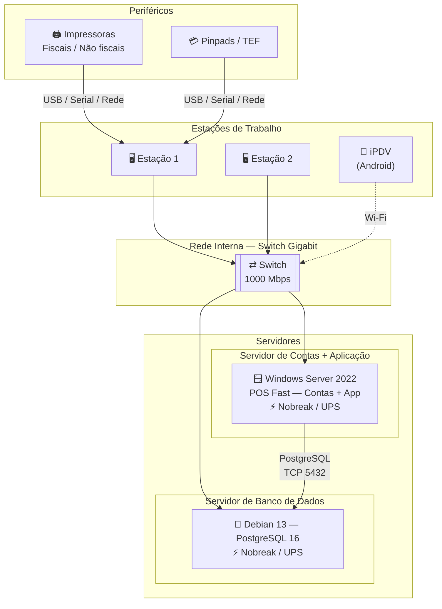
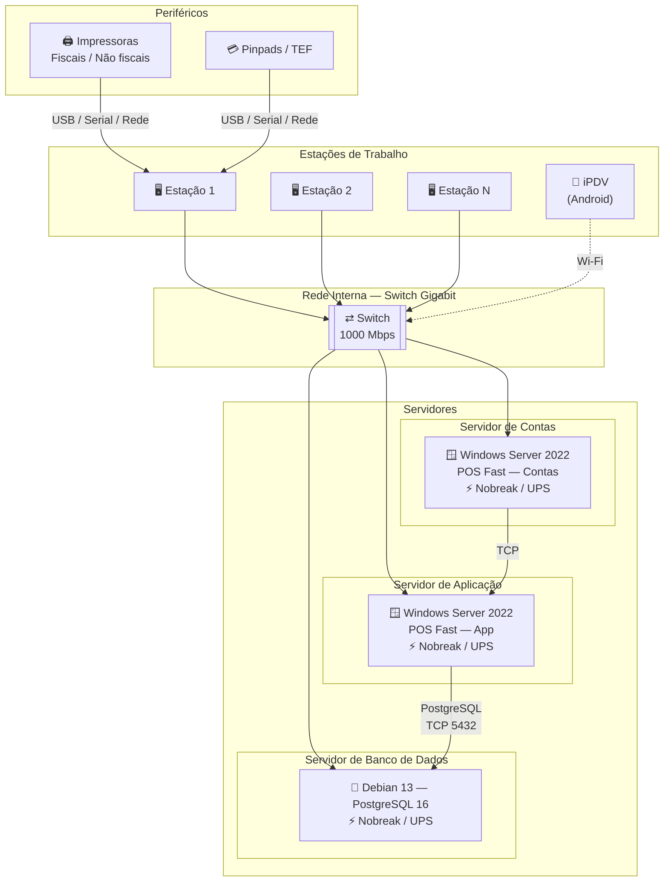

# Requisitos de Hardware — POS Fast by Desbravador

**Sistema:** POS Fast by Desbravador  
**Modalidade:** Instalação Local (On-Premise)  
**Público:** Cliente / Fornecedor de hardware / Equipe de TI

---

## Histórico de Revisões

| Versão | Data | Descrição | Responsável |
| --- | --- | --- | --- |
| 1.2 | Abr/2023 | Atualização | Andressa Celant |
| 1.3 | Mai/2026 | Atualização tecnologica | Desbravador Software Ltda. |

---

## 1. Objetivo

Este documento serve como guia para a preparação do ambiente de funcionamento do sistema POS Fast by Desbravador, abordando os requisitos técnicos de instalação e outras questões relacionadas.

Este descritivo pode ser repassado ao fornecedor de hardware selecionado e servirá como guia para a aquisição dos equipamentos. Os requisitos levam em consideração que os servidores serão utilizados exclusivamente pelos serviços relacionados ao POS Fast. Caso seja necessário compartilhar servidores com outros serviços ou softwares (ERPs, Web Servers, etc.), os requisitos dos demais serviços devem ser considerados no dimensionamento.

### Visão Geral da Arquitetura On-Premise

O POS Fast opera com até três papéis de servidor distintos: **Servidor de Contas**, **Servidor de Aplicação** e **Servidor de Banco de Dados**. Em instalações de até 20 usuários on-premise, o Servidor de Contas e o Servidor de Aplicação podem coexistir na mesma máquina.

#### Instalação pequena — até 20 usuários (servidores de Contas e Aplicação unificados)

#### Instalação maior — acima de 20 usuários (servidores separados)

---

## 2. Responsabilidades

### 2.1 Desbravador Software Ltda.

- A instalação do software do servidor é realizada exclusivamente pelo Analista de Implantação da Desbravador.
- A equipe Desbravador estará disponível para esclarecer dúvidas técnicas durante todo o período de implantação.

### 2.2 Cliente (LICENCIADO)

- Providenciar os equipamentos conforme especificações deste documento, com sistema operacional previamente instalado e configurado.
- Garantir o licenciamento dos sistemas operacionais e softwares adicionais utilizados.
- Prover segurança física e lógica para servidores e estações de trabalho.
- Disponibilizar técnico de hardware durante o período de implantação.
- Garantir a instalação e configuração de periféricos (impressoras, centrais telefônicas, fechaduras eletrônicas) para as devidas integrações.
- Realizar e manter rotinas de backup dos dados do sistema.

> ⚠️ **Atenção**
> - A Desbravador **NÃO** realiza montagem/desmontagem de hardware nem instalação de sistemas operacionais.
> - A segurança dos arquivos e dados do sistema é responsabilidade exclusiva de quem opera o sistema.
> - Operações indevidas, falhas nas rotinas de backup ou uso de mídia defeituosa são de responsabilidade do LICENCIADO.

---

## 3. Seleção do Fornecedor de Hardware

Ao selecionar o fornecedor de equipamentos, certifique-se de que ele oferece:

- Suporte técnico disponível 24 horas por dia.
- Presença física na mesma cidade ou região próxima ao estabelecimento.
- Garantia e assistência técnica dos equipamentos fornecidos.
- Capacidade de assumir responsabilidade pelo sistema operacional, rede e banco de dados.
- Referências de clientes e instalações anteriores verificáveis.

---

## 4. Configurações de Servidor por Quantidade de Usuários

---

### 4.1 Até 10 Usuários

> ℹ️ Nesta faixa, aplicação e banco de dados podem coexistir em um único servidor.

| Campo | Especificação |
| --- | --- |
| **Processador** | Intel Core i5 ou AMD X4 Quad-Core |
| **Memória RAM** | 16 GB |
| **Armazenamento** | 2 × SSD 500 GB (NVMe ou SATA) — obrigatório, preferencialmente em RAID 1 |
| **Sistema Operacional** | Microsoft Windows Server 2022 licenciado |
| **Banco de Dados** | PostgreSQL 16 |

---

### 4.2 De 11 a 20 Usuários

> ℹ️ O uso de dois servidores separados é recomendado para melhor desempenho.

#### ▸ Servidor de Contas e Aplicação

| Campo | Especificação |
| --- | --- |
| **Placa-Mãe** | Compatível com expansão de memória RAM. Marcas de referência: Asus, Intel, Soyo, MSI, Gigabyte. |
| **Processador** | Intel Core i5-2310 S1155 2,9 GHz com 6 MB de cache · AMD AM3+ FX-Serie FX-4100 3,6 GHz com 12 MB de cache |
| **Memória RAM** | 16 GB |
| **Armazenamento** | 2 × SSD 500 GB (NVMe ou SATA) — obrigatório, preferencialmente em RAID 1 |
| **Sistema Operacional** | Microsoft Windows Server 2022 licenciado |
| **Banco de Dados** | PostgreSQL 16 |

#### ▸ Servidor de Banco de Dados

| Campo | Especificação |
| --- | --- |
| **Placa-Mãe** | Compatível com expansão de memória RAM. Marcas de referência: Asus, Intel, Soyo, MSI, Gigabyte. |
| **Processador** | Intel Core i5-2310 S1155 2,9 GHz com 6 MB de cache · AMD AM3+ FX-Serie FX-4100 3,6 GHz com 12 MB de cache |
| **Memória RAM** | 8 GB |
| **Armazenamento** | 2 × SSD 500 GB (NVMe ou SATA) — obrigatório, preferencialmente em RAID 1 |
| **Sistema Operacional** | Debian 13 |
| **Banco de Dados** | PostgreSQL 16 |

---

### 4.3 De 21 a 40 Usuários

> ⚠️ **Obrigatório** — servidores de Contas, Aplicação e Banco de Dados separados.

#### ▸ Servidor de Contas

| Campo | Especificação |
| --- | --- |
| **Placa-Mãe** | Compatível com expansão de memória RAM. Marcas de referência: Asus, Intel, Soyo, MSI, Gigabyte. |
| **Processador** | Intel Core i7-3770T 3,70 GHz com 8 MB de cache · AMD Phenom II X6 1075T 3,0 GHz, 6 núcleos, cache 9 MB, Socket AM3 |
| **Memória RAM** | 16 GB |
| **Armazenamento** | 2 × SSD 500 GB (NVMe ou SATA) — obrigatório, preferencialmente em RAID 1 |
| **Sistema Operacional** | Microsoft Windows Server 2022 licenciado |

#### ▸ Servidor de Aplicação

| Campo | Especificação |
| --- | --- |
| **Placa-Mãe** | Compatível com expansão de memória RAM. Marcas de referência: Asus, Intel, Soyo, MSI, Gigabyte. |
| **Processador** | Intel Core i7-3770T 3,70 GHz com 8 MB de cache · AMD Phenom II X6 1075T 3,0 GHz, 6 núcleos, cache 9 MB, Socket AM3 |
| **Memória RAM** | 32 GB |
| **Armazenamento** | 2 × SSD 500 GB (NVMe ou SATA) — obrigatório, preferencialmente em RAID 1 |
| **Sistema Operacional** | Microsoft Windows Server 2022 licenciado |

#### ▸ Servidor de Banco de Dados

| Campo | Especificação |
| --- | --- |
| **Placa-Mãe** | Compatível com expansão de memória RAM. Marcas de referência: Asus, Intel, Soyo, MSI, Gigabyte. |
| **Processador** | Intel Core i7-3770T 3,70 GHz com 8 MB de cache · AMD Phenom II X6 1075T 3,0 GHz, 6 núcleos, cache 9 MB, Socket AM3 |
| **Memória RAM** | 16 GB |
| **Armazenamento** | 2 × SSD 500 GB (NVMe ou SATA) — obrigatório, preferencialmente em RAID 1 |
| **Sistema Operacional** | Debian 13 |
| **Banco de Dados** | PostgreSQL 16 |

---

### 4.4 Acima de 40 Usuários

Ambientes com mais de 40 usuários simultâneos requerem dimensionamento especializado, considerando volume de transações, número de terminais, integrações e infraestrutura disponível.

> ℹ️ Entre em contato com o setor de TI da Desbravador para avaliação e dimensionamento adequado ao seu ambiente.
> **Desbravador Software Ltda.**  
>  🌐 [www.desbravador.com.br](https://www.desbravador.com.br)

---

## 5. Estações de Trabalho

A qualidade da estação de trabalho tem papel fundamental no desempenho percebido pelo usuário, pois é ela que processa a massa de dados enviada pelo servidor.

### 5.1 Vida Útil e Processador

- Computadores devem ter no máximo **3 anos de uso**, principalmente em função do processador.
- Considerar processadores **Intel Core i3 ou superior** ou **AMD X4 Quad-Core**.
- **Desconsiderar** processadores Celeron, Atom e demais de baixíssima performance.

### 5.2 Memória e Armazenamento

| Cenário | Memória RAM | Disco |
| --- | --- | --- |
| Estações usando apenas o POS Fast | Mínimo 8 GB | SSD 500 GB |
| Estações com o POS Fast e outros aplicativos | Mínimo 16 GB | SSD 500 GB |

### 5.3 Demais Requisitos

| Componente | Especificação |
| --- | --- |
| **Placa de Rede** | Gigabit Ethernet /1000 Mbps (pode ser on-board) |
| **Portas Seriais** | Obrigatório para conexão com impressoras fiscais |
| **Antivírus** | Obrigatório (solução licenciada) |
| **Sistema Operacional** | Microsoft Windows 11, versão Professional, licenciado |

---

## 6. iPDV — Dispositivos Móveis

O iPDV é o aplicativo para lançamento em dispositivos móveis. Requisitos mínimos:

- Sistema operacional Android 11 ou superior.
- 4 GB de memória RAM ou superior.
- Tela de 6 polegadas ou maior.
- Se utilizar leitura de QR Code: câmera com no mínimo 2 megapixels.
- Se utilizar NFC de aproximação: o aparelho deve conter a funcionalidade. Tablets da linha A da Samsung não são compatíveis com NFC para este uso.

---

## 7. Hardwares Complementares (Todas as Configurações)

### 7.1 Armazenamento

- 2 discos SSD 500 GB (NVMe ou SATA) em cada servidor (marcas de referência: Samsung, Kingston, WD).
- Servidores e estações de trabalho com dados de missão crítica devem usar RAID Nível 1 ou 1+0.
- Para servidores de aplicação, RAID 1, RAID 1+0 ou RAID 5 são aceitos.

### 7.2 Dispositivos de Backup

- HD externo, gravador de CD/DVD, Pen Drive ou fita.
- **IMPORTANTE:** dispositivos externos de backup devem ser conectados ao servidor apenas no momento da realização do backup.
- Um local de backup externo (nuvem) deve ser configurado pela equipe de TI do cliente para backup completo do banco de dados e arquivos de aplicação.

### 7.3 Rede

- **Placa de rede:** Gigabit Ethernet /1000 Mbps (pode ser on-board). Marcas de referência: 3COM, Encore, TP-Link.
- **Switch:** portas /1000 Mbps. Marcas de referência: Dell, HP, 3COM, Encore, TP-Link.
- ⚠️ A velocidade de comunicação é limitada pelo componente mais lento — placa de rede e switch devem ter a mesma capacidade.
- Recomenda-se redundância de placa de rede nos servidores.

### 7.4 Proteção Elétrica

- **Nobreak (UPS)** para o servidor — indispensável para proteger o banco de dados contra quedas de energia.

---

## 8. Rede e Diretrizes de Comunicação

> ⚠️ **URL obrigatória — liberação em proxy/firewall de saída**
> O endereço `https://servicos.desbravador.com.br/` deve estar **permitido (bypass)** em proxies, filtros de conteúdo e firewalls de saída. O bloqueio desta URL impede o funcionamento de serviços essenciais do sistema.

O POS Fast pode ser instalado on-premise, em datacenter ou em modelo híbrido. Independentemente da modalidade, a comunicação de rede deve ser cuidadosamente arquitetada. Os três requisitos fundamentais são:

### Segmentação de Rede

> ⚠️ **Obrigatório** — a rede utilizada pelo sistema POS Fast (servidores e estações de trabalho) deve ser **obrigatoriamente segmentada** da rede de clientes (Wi-Fi de hóspedes ou rede pública). A segmentação deve ser realizada por VLAN ou rede física separada, garantindo que o tráfego do sistema não seja acessível a dispositivos externos.

### Latência

Quantidade de atraso que uma solicitação leva para ser transferida entre dois pontos, medida em milissegundos (ms).

- **Recomendação:** entre 1 ms e 80 ms entre a estação cliente e o servidor.

### Largura de Banda

Capacidade da rede de transferir dados, geralmente limitada pelo link de acesso de borda.

- **Recomendação:** mínimo de 10 Mbps exclusivos para uso do sistema.
- Avaliar a necessidade de link de acesso redundante para mitigar risco de interrupção única de rede.

### Jitter

Variação no atraso de entrega de pacotes em rede, causando interrupção na sequência normal de troca de dados.

- **Recomendação:** jitter abaixo de 20 ms para que o atraso não seja percebido pelo usuário.

### Infraestrutura Wi-Fi e Mobilidade

A operação do POS Fast em ambientes de restaurante depende de conectividade sem fio contínua e estável. Diferentemente de aplicações de escritório, o POS Fast sustenta fluxos de dados em tempo real entre comandas móveis, tablets de atendimento, terminais de autoatendimento, KDS de cozinha e o servidor central. Qualquer degradação na rede Wi-Fi se traduz diretamente em impacto operacional: comandas perdidas, falhas em transações de pagamento eletrônico, desconexão de integrações e indisponibilidade parcial do PDV. A infraestrutura wireless não é um elemento de conforto — é parte crítica da arquitetura do sistema.

#### Cobertura do Ambiente

Todas as áreas operacionais do estabelecimento devem ter cobertura Wi-Fi efetiva, sem zonas de sombra ou degradação de sinal. As seguintes áreas são obrigatórias:

- Salão de atendimento (incluindo todas as mesas e estações de garçom)
- Cozinha e área de preparo
- Bar e balcão
- Caixas e pontos de pagamento
- Áreas externas, terraços e mezaninos operacionais
- Estação de expedição e empacotamento para delivery
- Estoque e almoxarifado (caso haja integração com módulo de insumos)
- Recepção e área de espera

> ⚠️ **Atenção** — Cobertura parcial do ambiente invalida a operação mobile do POS Fast. Tablets, comandas e terminais desconectados em trânsito causam inconsistência de dados e falhas em transações em andamento.

#### Padrão e Tecnologia da Rede

| Critério | Especificação |
| --- | --- |
| Padrão mínimo | Wi-Fi 5 (802.11ac), banda dupla (2,4 GHz e 5 GHz) |
| Padrão recomendado | Wi-Fi 6 (802.11ax) para ambientes com alta densidade de dispositivos |
| Frequência operacional dos dispositivos POS Fast | 5 GHz (prioritária) |
| Equipamentos domésticos (roteadores ISP, repetidores de varejo) | **Vedados** |

O uso de roteadores residenciais ou equipamentos fornecidos por provedores de internet para fins domésticos não é suportado em ambiente de produção. Esses dispositivos não oferecem controle de QoS, gerenciamento centralizado, suporte a roaming ou desempenho adequado sob carga simultânea de múltiplos clientes.

> ℹ️ Wi-Fi 6 é especialmente indicado em estabelecimentos com mais de 20 dispositivos simultâneos, devido à tecnologia OFDMA que reduz colisões e melhora a eficiência espectral em ambientes densos.

#### Dimensionamento de Access Points

O número e o posicionamento de Access Points (APs) devem ser determinados por levantamento técnico prévio (site survey), considerando os seguintes fatores:

- **Metragem e planta baixa:** em geral, um AP por andar ou por área de até 80–120 m² em espaços abertos; áreas com obstáculos exigem APs adicionais
- **Quantidade de dispositivos:** recomenda-se no máximo 20–25 dispositivos ativos por AP em ambiente de restaurante
- **Barreiras físicas:** paredes de alvenaria, vidros temperados, equipamentos de cozinha industrial e câmaras frias atenuam significativamente o sinal e exigem compensação no projeto
- **Múltiplos andares:** cada pavimento deve ter sua própria célula de cobertura; não é aceitável depender de sinal proveniente de andar adjacente
- **Gerenciamento centralizado:** todos os APs devem ser gerenciados por um controlador unificado (hardware dedicado, virtual ou cloud), permitindo visibilidade centralizada, configuração consistente e diagnóstico em tempo real

#### Roaming e Mobilidade

O roaming contínuo entre Access Points é requisito funcional para a operação do POS Fast. Garçons, operadores de comanda e terminais móveis transitam pelo estabelecimento durante toda a operação, e a troca de AP deve ocorrer de forma transparente, sem interrupção de sessão ou perda de pacotes.

São requisitos para suporte a roaming:

- Todos os APs devem pertencer ao mesmo controlador e compartilhar o mesmo SSID e configurações de segurança
- Suporte a **802.11r** (Fast BSS Transition) para redução do tempo de handoff
- Suporte a **802.11k** e **802.11v** para orientação inteligente de dispositivos ao AP mais adequado (band steering e neighbor reporting)
- Tempo de transição entre APs inferior a 50 ms

> ⚠️ **Atenção** — Redes compostas por APs independentes sem controlador centralizado não suportam roaming adequado e são incompatíveis com a operação contínua de comandas eletrônicas e KDS.

#### Latência e Estabilidade da Rede Wireless

| Métrica | Requisito |
| --- | --- |
| Latência (dispositivo → servidor, rede local) | < 20 ms |
| Jitter máximo | < 5 ms |
| Perda de pacotes | 0% em condições normais de operação |
| Disponibilidade da rede local | ≥ 99,5% no período de operação do estabelecimento |

Oscilações de latência acima de 50 ms causam degradação visível na resposta de comandas e podem provocar timeout em transações TEF móvel. Instabilidade recorrente compromete a integridade da sincronização em tempo real entre dispositivos e servidor, podendo resultar em divergência de dados operacionais.

#### Segmentação da Rede Wireless

A rede wireless do estabelecimento deve ser segmentada em ao menos duas redes lógicas distintas, isoladas entre si por VLAN ou por firewall:

| Rede | Finalidade | Dispositivos | Acesso à internet | Isolamento |
| --- | --- | --- | --- | --- |
| Corporativa (POS) | Operação do POS Fast | Comandas, tablets, terminais, KDS, servidor | Controlado e restrito | Total em relação à rede Guest |
| Guest / Clientes | Acesso de clientes do estabelecimento | Dispositivos pessoais dos clientes | Irrestrito (com filtro de conteúdo) | Total em relação à rede Corporativa |

> ℹ️ O isolamento entre redes é medida de segurança e estabilidade. Dispositivos de clientes na mesma rede dos terminais POS representam risco de interferência, saturação de banda e potencial vetor de ataque.

Caso o estabelecimento opere com integração a sistemas de terceiros (delivery, reservas, fiscal), recomenda-se uma terceira VLAN dedicada a essas integrações, igualmente isolada da rede Corporativa principal.

#### Internet e Contingência

- O estabelecimento deve dispor de link de internet dedicado, contratado junto a provedor com SLA definido e suporte técnico disponível no horário de operação
- A velocidade mínima recomendada é de **50 Mbps de download e 20 Mbps de upload** para operações com TEF, NFC e integrações em nuvem
- Recomenda-se fortemente a contratação de um segundo link de internet de provedor distinto, configurado em failover automático
- O equipamento de borda (roteador/firewall) deve suportar dual-WAN com failover transparente, de modo que a transição entre links não interrompa sessões ativas

> ⚠️ **Atenção** — Operações com TEF (pagamentos eletrônicos) requerem conectividade com a internet para autorização das transações. A ausência de contingência de link expõe o estabelecimento à inviabilização total de pagamentos por cartão durante falhas no provedor principal.

#### Equipamentos Recomendados

A Desbravador recomenda equipamentos de fabricantes corporativos com suporte a gerenciamento centralizado, atualizações de firmware regulares e histórico de compatibilidade com ambientes de alta densidade. Os fabricantes homologados para uso com o POS Fast são:

- **Ubiquiti UniFi** — controlador integrado, excelente custo-benefício para pequenas e médias operações
- **Aruba Networks (HPE)** — solução enterprise com recursos avançados de RF e segurança
- **Cisco (Meraki / Catalyst Wireless)** — plataforma cloud-managed de alta disponibilidade
- **TP-Link Omada** — alternativa de entrada com gerenciamento centralizado, adequada para estabelecimentos menores
- **Fortinet (FortiAP)** — recomendado quando integrado ao firewall FortiGate do mesmo ecossistema
- **MikroTik** — adequado para redes com profissional técnico dedicado à configuração e manutenção

A escolha do fabricante deve ser guiada pelo porte do estabelecimento, pela complexidade do ambiente e pela disponibilidade de suporte técnico especializado na região.

#### Segurança da Rede Wireless

- Protocolo de segurança mínimo: **WPA2-AES**; recomendado: **WPA3** para todos os novos equipamentos
- Senhas de rede com no mínimo 16 caracteres, combinando letras maiúsculas, minúsculas, números e caracteres especiais
- Troca periódica de credenciais da rede Corporativa, com controle de acesso restrito ao time de TI do estabelecimento
- Firmware de todos os APs e equipamentos de rede mantido atualizado, com ciclo de revisão mensal
- Desativação de protocolos legados (WEP, WPA-TKIP, 802.11b) em todos os equipamentos
- Habilitação de isolamento de cliente na rede Guest para impedir comunicação entre dispositivos de visitantes

#### Responsabilidade pela Infraestrutura Wireless

A infraestrutura de rede Wi-Fi é de responsabilidade exclusiva do cliente/estabelecimento. A Desbravador Software Ltda. não fornece, dimensiona, instala ou mantém equipamentos de rede. O suporte técnico ao POS Fast não cobre ocorrências originadas por falhas, limitações ou configurações inadequadas da rede local.

Recomenda-se que o projeto de infraestrutura wireless seja executado por profissional ou empresa especializada em redes corporativas, com entrega de documentação técnica (planta de cobertura, inventário de equipamentos, topologia lógica e diagrama de VLANs) antes da implantação do POS Fast.

> ℹ️ A qualidade da infraestrutura de rede é o principal fator externo que determina a estabilidade operacional do POS Fast. Estabelecimentos que investem em rede corporativa adequada relatam consistentemente menor incidência de chamados técnicos e maior satisfação na operação diária do sistema.

---

## 9. Segurança

Princípios gerais para utilização segura do POS Fast:

- Manter o software sempre atualizado, incluindo a versão mais recente do produto e patches aplicáveis.
- Limitar os privilégios de usuário ao mínimo necessário para a execução de suas funções. Revisar periodicamente.
- Instalar o software com segurança: use firewalls, protocolos seguros (TLS/SSL) e senhas seguras.

---

## 10. Virtualização

> ⚠️ **Atenção:** A Desbravador não certificou nenhum de seus produtos em ambientes de virtualização VMware ou equivalentes.

O suporte da Desbravador em ambientes virtualizados funciona da seguinte forma:

- Suporte prestado apenas para problemas que ocorrem no sistema operacional nativo ou demonstráveis como resultado direto da VM.
- Para problemas conhecidos da Desbravador, a solução recomendada será para o SO nativo. Caso não funcione no ambiente VM, o cliente será encaminhado ao fornecedor da plataforma de virtualização.

---

## 11. Acesso Remoto (Quando Aplicável)

Para estabelecimentos com banco de dados fora da empresa ou que necessitem de acesso externo via Terminal Service.

### 11.1 Servidor de Aplicação

- Deve desempenhar o papel de Controlador de Domínio.
- Deve administrar o serviço de Terminal Service (Remote Desktop Services).

---

## 12. Periféricos Homologados

O sistema possui integração desenvolvida e homologada com os seguintes periféricos:

- 💳 [Pinpads homologados](./../../perifericos/pinpads-homologados.md)
- 💳 [Sistemas de TEF homologados](./../../perifericos/tef-homologados.md)
- 🖨️ [Impressoras não fiscais e fiscais homologadas](./../../perifericos/impressoras-homologadas.md)
- 🍳 [Desbravador KDS — requisitos de hardware e infraestrutura](./../../perifericos/kds-desbravador.md)

---

## 13. Contato e Suporte

**Desbravador Software Ltda.**  
 🌐 [www.desbravador.com.br](https://www.desbravador.com.br)

Para dúvidas técnicas durante a implantação, a equipe Desbravador estará disponível para esclarecimentos.
