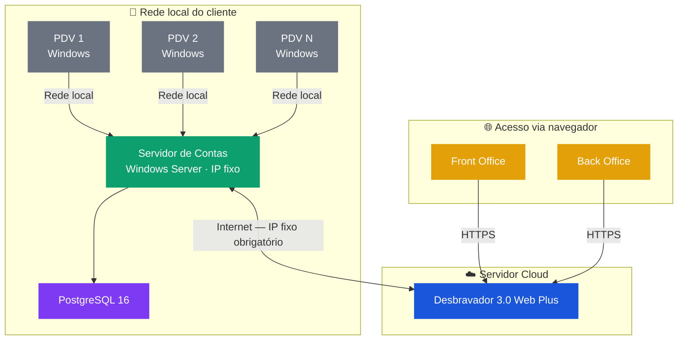

# Requisitos de Hardware — Light Web Plus / 3.0 Web Plus

**Sistema:** Desbravador Light Web Plus / 3.0 Web Plus  
**Modalidade:** Instalação Local (On-Premise) e Cloud  
**Público:** Cliente / Fornecedor de hardware / Equipe de TI

---

## Visão Geral da Arquitetura

---

## Histórico de Revisões

| Versão | Data | Descrição | Responsável |
| --- | --- | --- | --- |
| 1.0 | Mai/2025 | Criação do documento | Desbravador Software Ltda. |
| 1.1 | Jun/2025 | Atualização | Desbravador Software Ltda. |
| 1.2 | Mai/2026 | Atualização das versões mínimas de navegador (Chrome/Edge 148, Firefox 138) | Desbravador Software Ltda. |

---

## Considerações Iniciais

Antes de iniciar a implantação do Light Web Plus ou 3.0 Web Plus, o cliente deve estar ciente dos seguintes pontos:

- **IP fixo público** é obrigatório para integração com canais, gateways de pagamento e acesso remoto seguro.
- O sistema opera exclusivamente em **ambiente Windows** (Server ou Desktop homologado) — outros sistemas operacionais não são suportados.
- Todas as estações acessam o sistema via navegador web (Google Chrome ou Firefox); não há instalação de cliente nas estações.
- Os relatórios são gerados em formato PDF — todas as estações devem ter um leitor de PDF instalado (o próprio Chrome atende esse requisito).
- Durante o treinamento online, é essencial a disponibilidade e participação ativa dos usuários responsáveis pela operação do sistema.

---

## 1. Objetivo

Este documento serve como guia para a preparação do ambiente de funcionamento do Desbravador Light Web Plus e 3.0 Web Plus, abordando os requisitos técnicos de hardware, software, rede e integrações necessários para instalação e operação em regime local (on-premise) ou cloud.

Este descritivo pode ser repassado ao fornecedor de hardware selecionado e servirá como base para aquisição e configuração dos equipamentos.

---

## 2. Responsabilidades

### 2.1 Desbravador Software Ltda.

- A instalação do software do servidor é realizada exclusivamente pelo Analista de Implantação da Desbravador.
- A equipe Desbravador estará disponível para esclarecer dúvidas técnicas durante todo o período de implantação.

### 2.2 Cliente (LICENCIADO)

- Providenciar os equipamentos conforme as especificações deste documento, com sistema operacional previamente instalado e configurado.
- Garantir o licenciamento dos sistemas operacionais e softwares adicionais utilizados.
- Prover segurança física e lógica para servidores e estações de trabalho.
- Disponibilizar técnico de hardware durante o período de implantação.
- Garantir a instalação e configuração de periféricos para as devidas integrações.
- Realizar e manter rotinas de backup dos dados do sistema.
- Providenciar IP fixo público e configurar as liberações de rede necessárias conforme o manual técnico.

> ⚠️ **Atenção**
> - A Desbravador **NÃO** realiza montagem/desmontagem de hardware nem instalação de sistemas operacionais.
> - A segurança dos arquivos e dados do sistema é responsabilidade exclusiva de quem opera o sistema.
> - Operações indevidas, falhas nas rotinas de backup ou uso de mídia defeituosa são de responsabilidade do LICENCIADO.

---

## 3. Seleção do Fornecedor de Hardware

Ao selecionar o fornecedor de equipamentos, certifique-se de que ele oferece:

- Suporte técnico disponível 24 horas por dia.
- Presença física na mesma cidade ou região próxima ao estabelecimento.
- Garantia e assistência técnica dos equipamentos fornecidos.
- Capacidade de assumir responsabilidade pelo sistema operacional, rede e configuração de servidor.
- Referências de clientes e instalações anteriores verificáveis.

---

## 4. Requisitos de Hardware

### 4.1 Servidor de Contas (aplicação)

> ⚠️ **Atenção** — O estabelecimento deve contar com IP fixo público configurado no servidor de aplicação. Sem IP fixo, integrações com canais de distribuição, gateways de pagamento e acesso remoto seguro não funcionarão corretamente.

| Item | Requisito Mínimo | Recomendado (Alta Performance) |
| --- | --- | --- |
| **Processador** | Intel Core i5 8ª geração ou superior | Intel Xeon · AMD Ryzen 7 ou superior |
| **Memória RAM** | 8 GB | 16 GB ou mais |
| **Armazenamento** | SSD 240 GB | SSD NVMe 500 GB (preferencialmente em RAID 1) |
| **Sistema Operacional** | Microsoft Windows Server 2022 licenciado | Microsoft Windows Server 2022 licenciado |
| **Rede** | 100 Mbps | 1 Gbps |
| **IP Fixo Público** | Obrigatório | Obrigatório |
| **Nobreak (UPS)** | Recomendado | Recomendado |

> ℹ️ Ambientes virtualizados (VMware, Hyper-V, Proxmox) são suportados, desde que os recursos de CPU, memória e armazenamento sejam dedicados — não compartilhados com outras VMs em produção. Consulte a seção [Virtualização](#7-virtualização) para detalhes.

### 4.2 Estações de Trabalho

As estações acessam o sistema exclusivamente via navegador web. Não há instalação de software cliente nas estações.

| Item | Requisito Mínimo | Recomendado (Alta Performance) |
| --- | --- | --- |
| **Processador** | Intel Core i3 ou equivalente | Intel Core i5 ou superior |
| **Memória RAM** | 8 GB | 16 GB ou mais |
| **Armazenamento** | SSD 120 GB | SSD 240 GB |
| **Navegador** | Google Chrome 148 · Mozilla Firefox 138 · Microsoft Edge 148 | Google Chrome (última versão) |
| **Resolução de tela** | 1024 × 768 | 1920 × 1080 |
| **Sistema Operacional** | Microsoft Windows 11 ou superior, licenciado | Microsoft Windows 11 Pro, licenciado |
| **Leitor de PDF** | Obrigatório (o próprio Chrome atende) | Obrigatório |
| **Antivírus** | Instalado e atualizado | Instalado e atualizado |
| **Nobreak (UPS)** | Recomendado | — |

### 4.3 iPDV — Dispositivos Móveis

O iPDV é o aplicativo para lançamento em dispositivos móveis. Requisitos mínimos:

- Sistema operacional Android 8.0 ou superior.
- 4 GB de memória RAM ou superior.
- Tela de 6 polegadas ou maior.
- Se utilizar leitura de QR Code: câmera com no mínimo 2 megapixels.
- Se utilizar NFC de aproximação: o aparelho deve conter a funcionalidade. Tablets da linha A da Samsung não são compatíveis com NFC para este uso.

---

## 5. Requisitos de Rede

| Item | Especificação |
| --- | --- |
| **Conexão com a internet** | Estável, mínimo 10 Mbps dedicados ao sistema |
| **IP fixo público** | Obrigatório |
| **Firewall / NAT** | Liberação de portas conforme manual técnico da Desbravador |
| **DNS** | Preferencialmente DNS público Google (8.8.8.8 / 8.8.4.4) |
| **VPN** | Opcional — recomendada para acesso remoto seguro à administração do sistema |

> ⚠️ **URL obrigatória — liberação em proxy/firewall de saída**
> O endereço `https://servicos.desbravador.com.br/` deve estar **permitido (bypass)** em proxies, filtros de conteúdo e firewalls de saída. O bloqueio desta URL impede o funcionamento de serviços essenciais do sistema.

---

## 6. Requisitos Adicionais por Integração

| Integração | Requisito |
| --- | --- |
| **Acesso ao servidor** | IP fixo público, DNS configurado e domínio registrado |
| **Emissão de NF-e / NFC-e** | Certificado digital A1 válido |
| **Gateways de pagamento** | Comunicação HTTPS liberada e callbacks configurados no firewall |
| **Impressoras fiscais** | Verificar compatibilidade de modelo e instalação de drivers |
| **Central telefônica** | Bilhetagem via serial ou TCP/IP; computador Windows dedicado para conexão física quando necessário |
| **Firewall de borda** | Recomendado com registro de tráfego habilitado |

> ⚠️ **Atenção** — A emissão de NF-e/NFC-e requer certificado digital A1 instalado no servidor de aplicação. O certificado deve estar dentro do prazo de validade e ser do tipo A1 (arquivo .pfx). Certificados A3 (token/smartcard) não são suportados nesta modalidade.

---

## 7. Virtualização

> ℹ️ VMware, Hyper-V e Proxmox são suportados para execução do servidor de aplicação do Light Web Plus / 3.0 Web Plus, desde que os recursos alocados à VM sejam dedicados e não disputados com outras instâncias em produção.

Requisitos para ambientes virtualizados:

- CPU com núcleos dedicados (não compartilhados via overcommit).
- Memória RAM alocada de forma fixa, sem ballooning dinâmico.
- Armazenamento em disco provisionado com provisioning espesso (thick provisioning) para evitar degradação de I/O.
- Rede em modo bridge ou acesso direto ao adaptador físico — evitar NAT interno entre VMs.

O suporte da Desbravador em ambientes virtualizados cobre problemas demonstráveis como resultado direto do sistema operacional ou da aplicação. Problemas originados na camada de virtualização serão encaminhados ao fornecedor da plataforma.

---

## 8. Periféricos Homologados

O sistema possui integração desenvolvida e homologada com os seguintes periféricos:

- 🖨️ [Impressoras fiscais e não fiscais homologadas](./../../perifericos/impressoras-homologadas.md)
- 💳 [Pinpads homologados](./../../perifericos/pinpads-homologados.md)
- 💳 [Sistemas de TEF homologados](./../../perifericos/tef-homologados.md)
- 🔒 [Fechaduras e tarifadores homologados](./../../perifericos/fechaduras-homologadas.md)

---

## 9. Observações Finais

- Os requisitos descritos neste documento estão sujeitos a revisão conforme a evolução do produto e das tecnologias envolvidas. Consulte sempre a versão mais recente antes de iniciar uma nova implantação.
- Durante o treinamento online, é essencial a disponibilidade e participação ativa dos usuários responsáveis pela operação do sistema. Treinamentos realizados sem a presença dos operadores diretos impactam negativamente a adoção e o suporte pós-implantação.

---

## 10. Contato e Suporte

**Desbravador Software Ltda.**  
 🌐 [www.desbravador.com.br](https://www.desbravador.com.br)

Para dúvidas técnicas durante a implantação, a equipe Desbravador estará disponível para esclarecimentos.
